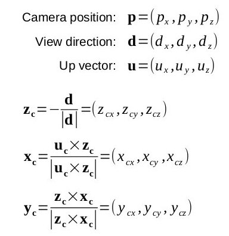
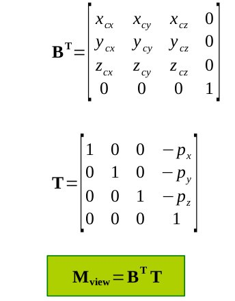
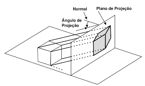
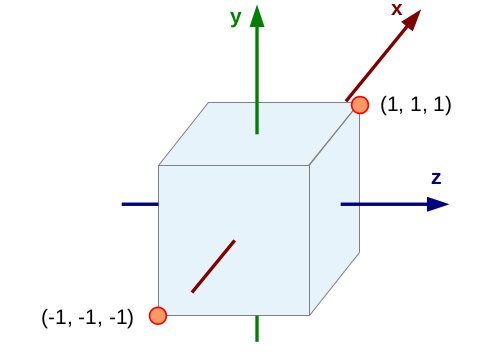
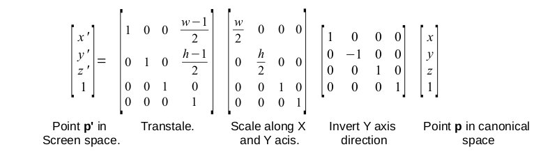
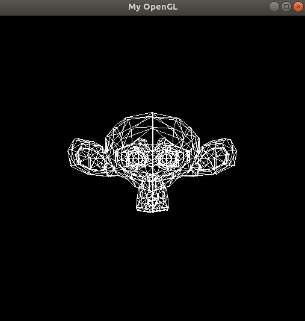

### Atividade-2-cg-2018-2
Simulação de Pipeline Gráfico

### Trabalho realizado pelos alunos:

 - Augusto Henrique O. dos Anjos - Matrícula: 20170009919

 - Luiz Felipe Soares Cardoso - Matrícula: 20170000717

## Introdução

Um Pipeline Gráfico no mundo da computação gráfica basicamente trata de realizar as transformações geométricas necessárias para que cada vértice pertencente a um objeto seja levado entre os demais espaços existentes até o último espaço de tela e assim possa ser renderizado na tela.

O trabalho realizado consiste na implementação de uma espécie de pipeline gráfico similar ao do OpenGl em suas etapas com todas as transformações de espaços e o trajeto desde o espaço objeto até chegar no espaço de tela.

Todas as transformações apresentadas aqui estarão na forma de matriz num espaço 3D com coordenadas homogêneas, ou seja, as matrizes serão 4x4. Os códigos contém resultados similares ao apresentado em OpenGl e são implementadas na linguagem de programação C++.

Desta forma tratamos de 5 tipos de transformações ao longo de 6 espaços. Sendo eles na ordem: 

Objeto -> Universo -> Câmera -> Recorte -> Canônico -> Tela

Todas estas transformações serão aqui discorridas

## Espaço Objeto --> Espaço Universo

Primeiramente foi necessário a criação de uma nova classe ‘pipeline.h’ onde nela está definida e criada todas as matrizes e transformações. O objeto modelo é feito primeiramente no espaço objeto onde poderá ser transformado geometricamente através da matriz Model, sendo levado para o espaço Universo. A matriz Model é feita a partir da multiplicação de todas as matrizes que podem alterar a forma do objeto, sendo elas: Escala(Que altera o tamanho do objeto), Translação(Que altera a posição do objeto no universo), Rotação (nos eixos X, Y e Z. De forma intuitiva, ela rotaciona o objeto) e Shear que devido a sua complexidade não foi inserida no trabalho.

Após a multiplicação de cada vértice do objeto pela matriz Model, o mesmo é levado para o Espaço Universo. 

Para implementar estas matrizes utilizamos a biblioteca GLM que funciona recebendo as colunas em forma de linha

```c++

    glm::mat4x4 mTranslacao = glm::mat4x4(1, 0, 0, 0,
                                          0, 1, 0, 0,
                                          0, 0, 1, 0,
                                          0, 0, 0, 1);

    glm::mat4x4 mEscala = glm::mat4x4(1, 0, 0, 0,
                                      0, -1, 0, 0,
                                      0, 0, 1, 0,
                                      0, 0, 0, 1); 

        float angX = 0.0;
        float angY = angulo;
        float angZ = 0.0;

    glm::mat4x4 mRotacaoX = glm::mat4x4(1, 0, 0, 0,
                                        0, cos(angX), sin(angX), 0,
                                        0, -sin(angX), cos(angX), 0,
                                        0, 0, 0, 1);

    glm::mat4x4 mRotacaoY = glm::mat4x4(cos(angY), 0, -sin(angY), 0,
                                      0, 1, 0, 0,
                                      sin(angY), 0, cos(angY), 0,
                                      0, 0, 0, 1);

    glm::mat4x4 mRotacaoZ = glm::mat4x4(cos(angZ), sin(angZ), 0, 0,
                                        -sin(angZ), cos(angZ), 0, 0,
                                        0, 0, 1, 0,
                                        0, 0, 0, 1);

    glm::mat4x4 mRotacao = mRotacaoX*mRotacaoY*mRotacaoZ;

    glm::mat4x4 mModel = mTranslacao * mEscala * mRotacao;
```

Implementação das Matrizes que realizão as transformações no objeto

## Espaço Universo --> Espaço Câmera

Para passar do Espaço Univerço para o espaço de Câmera é necessário aplicar a Matriz View a todos os vértices do modelo que é feita a partir de uma translação e uma rotação baseada nas informações da câmera. Para definir a câmera é necessário definir três parâmetros: sua posição, sua cabeça(up) e o ponto a qual ela está olhando(look at).

Ao definir as características da câmera, podemos obter os eixos de coodenadas (x, y e z) a partir de multiplicações vetoriais e/ou normalizações que se baseiam neste projeto na regra da mão direita.


<p align="center"> 

</p>

Cálculos necessários para obteção das cordenadas a partir das 3 características da câmera. Sua Posição P, seu up U e sua direção(look at - posição).

Com isso podemos construir as duas matrizes responsáveis pela rotação e translação do espaço - Bt e T.

<p align="center"> 

</p>

Matrizes Bt e T, a multiplicação das duas resulta na matriz View que desloca o objeto do espaço Universo para o espaço de Câmera.

## Espaço Câmera --> Espaço Recorte


Nesta etapa, são recortadas as partes da cena que não entram no campo de visão da câmera, realizamos a multiplicação de cada vértice por uma matriz chamada matriz de Projeção que se concentra numa relação do objeto e de sua distância focal para o centro da câmera. Uma sequência de simplificações e cálculos resulta na seguinte matriz final de projeção

```c++
glm::mat4x4 mProjecao = glm::mat4x4(1,0,0,0,
                                        0,1,0,0,
                                        0,0,1,-(1/d),
                                        0,0,d,0);

```
Implementação da Matriz de Projeção

Desta forma podemos transmitir na rasterização do objeto uma simulação de perspectiva onde quanto maior a sua distância para o view plane(O qual projeta a imagem ao centro da câmera) menor a sua escala partindo para o infinito de Z negativo. Chegando assim no espaço projetivo onde a cordenada homogênea W é provavelmente diferente de 1, feito inédito das transformações no pipeline.

<p align="center"> 

</p>

Projeção no Espaço Projetivo com uso do View Plane

## Espaço Recorte --> Espaço Canônico

Nesta etapa a homonegização das cordenadas foi adiada para a final do pipeline para melhoria e facilitação da implementação destas possíveis transformações. A homonegização das cordenadas, seria a divisão de todas elas(x, y, z, w) por w, inclusive ele mesmo. Fazendo assim com que a cordenada homogênea volte a ser 1. 

Nesta etapa é necessário apenas entender que os vértices do espaço são multiplicados por uma matriz Canônica que, ao aplicar uma sequência de escalas e translações, transforma estes vértices para o espaço
canônico, gerando o boulding box necessiario que limita as coordenadas anteriores a um cubo de arestas tamanho '2' e que centraliza o cenário.


<p align="center"> 

</p>

"Boulding Box" responsável pelas limitações do espaço Canônico

## Espaço Canônico --> Espaço Tela

Como penúltima etapa, é necessária a transformação do espaço canônico para o espaço de tela por meio da aplicação de uma matriz nomeada ViewPort. Nela uma sequência de escalas e translações são realizadas possibilitando a correta interpretação do objeto com relação as limitações da tela.

No espaço canônico ja tinhamos chegado as cordenadas 2D que mesmo assim passam a ilusão de mundo 3D. Para ajuste das cordenadas com as necessidades de tela nós realizamos 3 ações.

Levamos a tela para as limitações positivas de X e Y multiplicando através de uma translação de todos os píxels por metade destas cordenadas.

Escalamos o tamanho da mesma por meio de a partir de sua altura e largura.

E por fim invertemos a cordenada Y que se trata de uma propriedade do espaço de tela.

<p align="center"> 

</p>


## Última etapa - Rasterização

Após a criação da Matriz final genérica mPipeline(Única utilizada na multiplicação por cada vértice) 

```c++
glm::mat4x4 mPipeline =  mViewPort * mProjecao * mView * mModel;
```


Como último passo, fazemos uso da última atividade de Computação Gráfica e, após carregadar o modelo do macaco contendo seus vértices assim como todas as tranformações necessárias ao longo do pipeline por meio da matriz única 'mPipeline' e homogenização, através da divisão de todos por w, chamamos a função 'DrawTriangle();' contida em 'mygl.h' responsável por desenhar todos os triângulos do macaco.

```c++
std::vector<glm::vec4> vertices = carregandoModelo("monkey.obj");

    for (int i = 0; i < vertices.size(); i++)
    {
        vertices[i] = mPipeline * vertices[i];
        vertices[i] = vertices[i] / vertices[i].w;
    }

    for (int i = 0; i < vertices.size(); i += 3)
    {

        DrawTriangle((int)vertices[i].x, (int)vertices[i].y, white,
                     (int)vertices[i + 1].x, (int)vertices[i + 1].y, white,
                     (int)vertices[i + 2].x, (int)vertices[i + 2].y, white);

    }

```

Desta forma chegamos a renderização do objeto

<p align="center"> 

</p>

## Resultados Obtidos

Como considerações finais, percebemos uma grande crescente no entendimento de como se dá o processo de transformações geométricas necessárias para migração dos vértices do objeto até o espaço de tela. Assim como as funções do Pipeline Gráfico e supostamente como são realizados os cálculos das transformações presentes em cada espaço.

## Principais dificuldades

Como principal dificuldade podemos citar a linguagem de programação utilizada C++, mas como defeito nosso. Devido ao baixo uso da mesma no dercorrer do curso, nós não tinhamos muito conhecimento e desta forma tivemos que aprender ela como forma de 'pre-requisito' para desenvolver a atividade. Na parte mais difícil da implementação podemos citar o carregamento do objeto através da função loader que é dotada de termos técnicos da linguagem.


